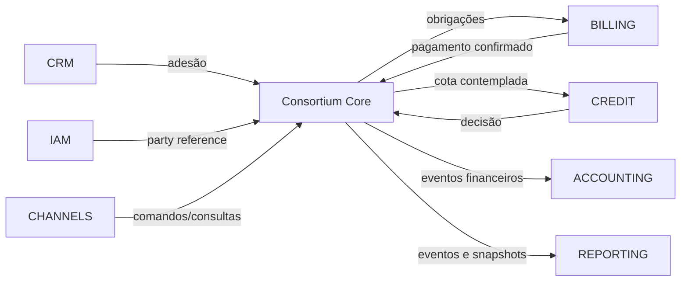

# 2. Escopo e fronteiras

## 2.1 Dentro do core

### Grupo

- regulamento e versões;
- categoria do objeto;
- quantidade máxima de cotas;
- prazo;
- créditos e critérios de atualização;
- fundos e taxas vinculadas ao grupo;
- calendário;
- critérios de elegibilidade;
- regras de contemplação;
- viabilidade;
- primeira assembleia;
- funcionamento;
- alterações aprovadas;
- encerramento.

### Cota

- identificação no grupo;
- disponibilidade e adesão;
- titularidade referencial;
- crédito;
- plano;
- obrigações;
- contribuições;
- situação de adimplência relevante ao domínio;
- elegibilidade;
- contemplação;
- exclusão;
- readmissão;
- transferência;
- quitação;
- encerramento.

### Assembleia

- posição congelada;
- participantes elegíveis;
- recursos disponíveis;
- sorteio;
- lances;
- contemplações;
- deliberações;
- ata estruturada;
- homologação, anulação e reprocessamento controlado.

### Posição financeira

- fundo comum;
- fundo de reserva;
- recursos vinculados;
- contribuições por cota;
- diferenças;
- antecipações;
- restituições;
- recursos remanescentes;
- movimentos e reversões.

## 2.2 Fora do core

| Capacidade | Sistema responsável | Interface com o core |
|---|---|---|
| Prospecção e venda | CRM | solicita reserva/adesão |
| Identidade e cadastro completo | IAM/MDM | fornece `partyReference` |
| Boleto/Pix | Billing/PSP | recebe obrigação; envia liquidação |
| Conciliação | Financeiro | envia pagamento confirmado |
| Cobrança | Collections | consulta dívida; envia acordo |
| PLD/FT | Compliance | envia decisão/restrição |
| Análise de crédito | Credit | recebe contemplação; devolve decisão |
| Garantias | Collateral | informa constituição/liberação |
| Pagamento ao fornecedor | Disbursement | recebe autorização |
| Documentos | DMS | armazena contratos/atas |
| Portal e aplicativo | Channels | usa APIs |
| Contabilidade societária | Accounting | consome eventos/lançamentos |
| BI regulatório | Reporting | consome snapshots/eventos |

## 2.3 Context map

## 2.4 Critério para inclusão

Uma capacidade pertence ao core quando altera uma das seguintes verdades:

1. composição ou estado do grupo;
2. composição ou estado da cota;
3. direito de concorrer;
4. resultado da assembleia;
5. direito de crédito;
6. posição financeira do grupo ou da cota;
7. obrigação ou restituição decorrente da participação;
8. encerramento do grupo.

## 2.5 Critério para exclusão

Uma capacidade fica externa quando apenas:

- capta, apresenta ou transporta informação;
- executa pagamento externo;
- avalia risco de crédito;
- gerencia relacionamento;
- cumpre função institucional da administradora sem alterar diretamente o domínio de grupos e cotas.
