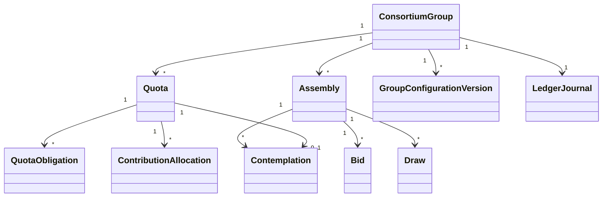

# 5. Modelo de domínio

## 5.1 Bounded contexts internos

### Group Management

Agregado principal: `ConsortiumGroup`.

Responsabilidades:

- configuração;
- regulamento;
- capacidade;
- prazo;
- formação;
- viabilidade;
- ativação;
- alterações;
- encerramento.

### Quota Lifecycle

Agregado principal: `Quota`.

Responsabilidades:

- disponibilização;
- reserva;
- adesão;
- titularidade;
- situação;
- exclusão;
- readmissão;
- transferência;
- quitação.

### Contributions

Agregados: `QuotaObligation`, `ContributionAllocation`.

Responsabilidades:

- calcular obrigações;
- receber confirmação de pagamento;
- apropriar rubricas;
- calcular saldo;
- antecipar;
- reverter.

### Assemblies

Agregado: `Assembly`.

Responsabilidades:

- preparar;
- congelar posição;
- processar sorteio e lance;
- produzir resultado;
- homologar;
- anular.

### Contemplation

Agregado: `Contemplation`.

Responsabilidades:

- registrar direito;
- controlar condição;
- cancelar quando permitido;
- informar disponibilidade do crédito.

### Group Ledger

Agregado: `LedgerJournal`.

Responsabilidades:

- registrar movimentos;
- validar equilíbrio;
- impedir edição;
- gerar posição por data.

## 5.2 Agregados

### ConsortiumGroup

```text
ConsortiumGroup
├── groupId
├── administratorReference
├── code
├── status
├── constitutionDate
├── firstAssemblyDeadline
├── startDate
├── endDate
├── maximumActiveQuotas
├── objectCategory
├── regulationVersionId
├── currentConfigurationVersion
├── viabilityAssessment
└── version
```

Invariantes:

- código único por administradora;
- capacidade positiva;
- prazo coerente;
- categoria homogênea segundo regra aplicável;
- não ativar sem viabilidade;
- não processar AGO antes da ativação;
- configuração efetiva é imutável após uso, salvo nova versão.

### Quota

```text
Quota
├── quotaId
├── groupId
├── number
├── status
├── partyReference
├── creditPlanId
├── admissionDate
├── exclusionDate
├── contemplationId
├── ownershipHistory
└── version
```

Invariantes:

- número único no grupo;
- uma cota não pode estar ativa para dois titulares;
- cota contemplada não segue o mesmo fluxo de exclusão da não contemplada;
- transferência preserva histórico;
- readmissão não excede capacidade.

### Assembly

```text
Assembly
├── assemblyId
├── groupId
├── sequence
├── type
├── scheduledAt
├── status
├── snapshotId
├── ruleSetVersion
├── draws
├── bids
├── contemplations
├── deliberations
└── resultHash
```

Invariantes:

- sequência única;
- somente uma posição congelada por processamento;
- resultado homologado é imutável;
- reprocessamento cria nova tentativa;
- sorteio precede lance quando exigido.

## 5.3 Entidades e value objects

### Value objects

- `Money`
- `Percentage`
- `CreditAmount`
- `QuotaNumber`
- `GroupCode`
- `ReferenceIndex`
- `RuleVersion`
- `EffectivePeriod`
- `BusinessDate`
- `AssemblySequence`
- `LedgerAccountCode`

### Entidades

- `GroupConfigurationVersion`
- `RegulationVersion`
- `CreditPlan`
- `PaymentPlan`
- `QuotaOwnership`
- `QuotaObligation`
- `ObligationComponent`
- `PaymentConfirmation`
- `ContributionAllocation`
- `Bid`
- `Draw`
- `Contemplation`
- `Exclusion`
- `Readmission`
- `Transfer`
- `GroupRepresentative`
- `Deliberation`
- `LedgerEntry`
- `AuditEvidence`

## 5.4 Diagrama conceitual


