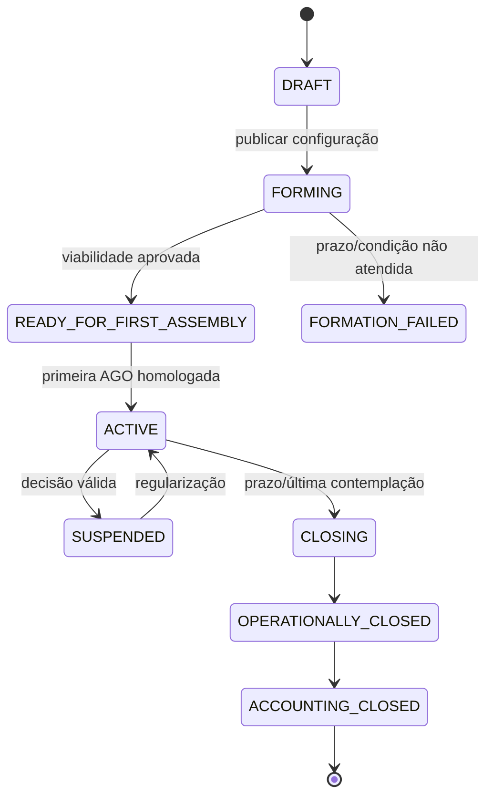
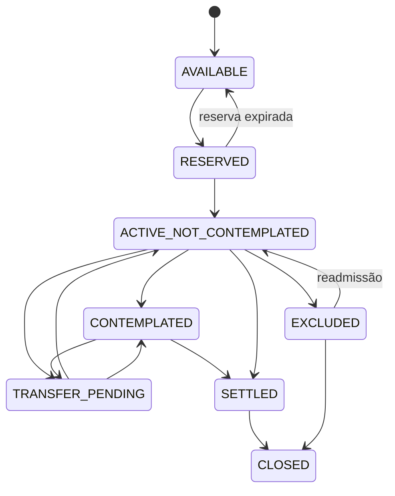
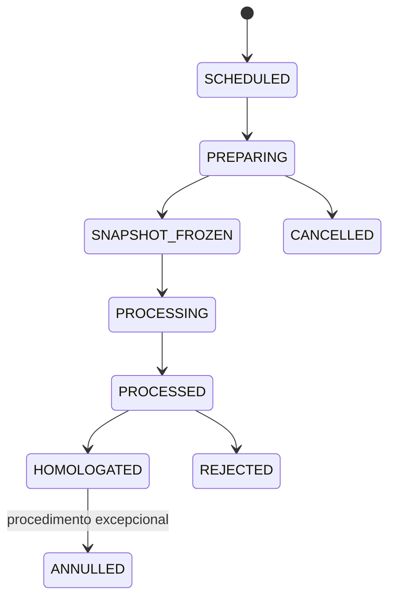

# 6. Estados e transições

## 6.1 Grupo



### Comandos

- `CreateGroup`
- `PublishGroupConfiguration`
- `AssessGroupViability`
- `AuthorizeFirstAssembly`
- `ActivateGroup`
- `SuspendGroup`
- `ResumeGroup`
- `BeginGroupClosure`
- `CloseGroupOperationally`
- `CloseGroupAccounting`

## 6.2 Cota



## 6.3 Assembleia



## 6.4 Contemplação

```text
REGISTERED
CONDITIONALLY_VALID
CONFIRMED
CANCELLED
CREDIT_AVAILABLE
CREDIT_USED
CLOSED
```

A liberação financeira externa não altera a existência histórica da contemplação.

## 6.5 Regras gerais de transição

Toda transição deve registrar:

- estado anterior;
- estado posterior;
- comando;
- ator ou sistema;
- regra aplicada;
- versão;
- data efetiva;
- instante;
- correlação;
- justificativa;
- evidências;
- eventos produzidos.

## 6.6 Concorrência

Agregados usam versão otimista. Comandos com versão defasada são rejeitados com erro de concorrência, sem mesclar decisões automaticamente.
