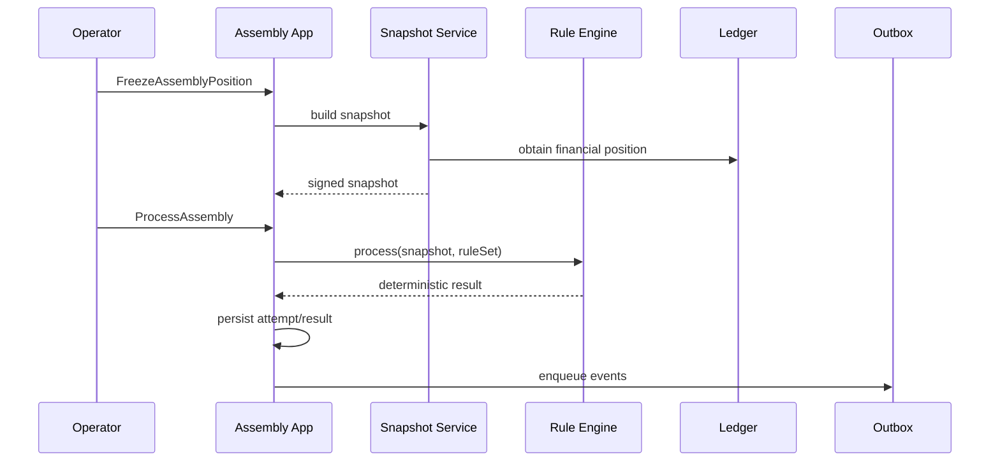

# 8. Arquitetura

## 8.1 Estilo

Monólito modular com arquitetura hexagonal e limites verificáveis.

```text
consortium-core
├── bootstrap
├── shared-kernel
├── regulation
├── group
├── quota
├── contribution
├── assembly
├── bid
├── contemplation
├── ledger
├── closure
├── audit
└── integration
```

Cada módulo:

```text
module
├── domain
├── application
├── adapter-in
└── adapter-out
```

## 8.2 Regras de dependência

- domínio não depende de Spring;
- aplicação depende do domínio;
- adaptadores dependem de aplicação;
- módulos não acessam tabelas de outros módulos;
- comunicação interna por portas e eventos;
- `shared-kernel` contém somente tipos estáveis.

## 8.3 Stack inicial

- Java 21;
- Spring Boot 3.x;
- PostgreSQL;
- Flyway;
- JPA/Hibernate para persistência comum;
- SQL explícito para ledger e consultas críticas;
- Testcontainers;
- ArchUnit;
- OpenAPI;
- Micrometer/OpenTelemetry;
- outbox transacional;
- Docker Compose para ambiente local.

## 8.4 Consistência

Operações dentro do agregado são transacionais.

Eventos externos são publicados por outbox após commit.

Operações críticas usam:

- chave de idempotência;
- optimistic locking;
- correlação;
- deduplicação;
- sequência por agregado quando necessária.

## 8.5 Tempo

É proibido chamar diretamente `now()` no domínio. Usa-se `Clock` e `BusinessCalendar`.

## 8.6 Regras

```java
public interface Rule<I, O> {
    RuleDescriptor descriptor();
    O evaluate(I input);
}
```

`RuleDescriptor`:

```text
ruleId
semanticVersion
legalBasis
effectiveFrom
effectiveUntil
implementationHash
```

## 8.7 Processamento de assembleia



## 8.8 Observabilidade

Métricas mínimas:

- comandos por resultado;
- conflitos de concorrência;
- duplicidades;
- tempo de processamento;
- falhas por regra;
- divergência de ledger;
- assembleias reprocessadas;
- eventos pendentes na outbox.

Logs nunca substituem evidência de negócio.
